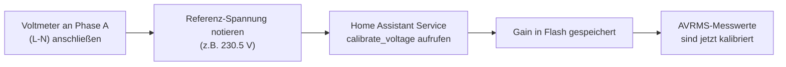

# ADE7880 ESPHome Custom Component - Implementation Guide

## 📋 Übersicht

Diese Custom Component für ESPHome ermöglicht die vollständige Steuerung und Kalibrierung des 3-Phasen-Energiemess-ICs **Analog Devices ADE7880** mit persistenter Speicherung der Kalibrierungsdaten im ESP32 Flash-Speicher.

### Kern-Features

- ✅ **I2C-Kommunikation** mit dem ADE7880 (Big-Endian, 16-Bit Adressen)
- ✅ **Registermethode zur Kalibrierung** via 24-Bit Signed Gain-Register
- ✅ **Persistente Speicherung** von Kalibrierungsfaktoren (ESPPreferences)
- ✅ **3-Phasen-Messung** (Spannung, Strom, Wirkleistung)
- ✅ **Home Assistant Integration** mit CustomAPI Services
- ✅ **Automatisches Laden** bei jedem Neustart

---

## 🔧 Hardware-Anforderungen

### Komponenten

| Komponente | Typ | Hinweise |
|-----------|-----|---------|
| **Mikrocontroller** | ESP32 | WROOM oder WROVER empfohlen |
| **Energiemess-IC** | ADE7880 | 3-Phasen, LQFP100 Gehäuse |
| **I2C Pull-ups** | 4.7 kΩ | Zwischen SDA/SCL und 3.3V |
| **Kondensatoren** | 100 nF | Für Stromversorgung (nach DB) |

### I2C Verkabelung (ESP32 → ADE7880)

```
ESP32                ADE7880
----                 --------
GPIO 21 (SDA) -----> SDA (Pin 72, I2C_SDA)
GPIO 22 (SCL) -----> SCL (Pin 71, I2C_SCL)
GND ------------> GND (Pins 12, 26, 50, 75, 100)
3.3V (optional) --> VDD_IO (Pin 73, wenn benötigt)
```

**I2C Adressen des ADE7880:**
- Standard (Hardware): `0x38` (dieses Projekt)
- Alternativ: `0x39` (konfigurierbar via Hardware-Pins)

---

## 📁 Datei-Struktur

```
custom_ade7880/
├── ade7880_calibration.h       # Header-Datei (Klassendefinition)
├── ade7880_calibration.cpp     # Implementierung
├── __init__.py                 # ESPHome Integration (Python)
├── example_config.yaml         # Beispiel YAML-Konfiguration
└── README.md                   # Dieses Dokument
```

---

## 📦 Installation & Setup

### 1. Komponente in ESPHome integrieren

**Option A: Lokal (für Entwicklung)**

```yaml
external_components:
  - source:
      type: local
      path: /config/custom_components/ade7880
    components: [ade7880]
```

**Option B: Git Repository**

```yaml
external_components:
  - source:
    github: leonw-04/custom_ade7880
    components: [ade7880]
```

### 2. I2C Bus konfigurieren

```yaml
i2c:
  id: bus_a
  sda: GPIO21
  scl: GPIO22
  frequency: 100kHz  # Conservative frequency for reliability
  scan: true
```

### 3. Sensoren definieren

```yaml
sensor:
  - platform: ade7880
    i2c_id: bus_a
    address: 0x38
    update_interval: 60s
    
    voltage_a:
      name: "Phase A Voltage"
    voltage_b:
      name: "Phase B Voltage"
    voltage_c:
      name: "Phase C Voltage"
    
    current_a:
      name: "Phase A Current"
    current_b:
      name: "Phase B Current"
    current_c:
      name: "Phase C Current"
    
    power_a:
      name: "Phase A Power"
    power_b:
      name: "Phase B Power"
    power_c:
      name: "Phase C Power"
```

---

## 🔌 Register-Mapping

### Measurement Registers (Lesen nur)

| Register | Adresse | Breite | Einheit | Formel |
|----------|---------|--------|--------|--------|
| AIRMS    | 0x43C0  | 4 Byte | A      | Wert × 0.0001 |
| AVRMS    | 0x43C1  | 4 Byte | V      | Wert × 0.001 |
| BIRMS    | 0x43C2  | 4 Byte | A      | Wert × 0.0001 |
| BVRMS    | 0x43C3  | 4 Byte | V      | Wert × 0.001 |
| CIRMS    | 0x43C4  | 4 Byte | A      | Wert × 0.0001 |
| CVRMS    | 0x43C5  | 4 Byte | V      | Wert × 0.001 |
| AWATT    | 0x43A8  | 4 Byte | W      | Wert × 0.01 (signed) |
| BWATT    | 0x43A9  | 4 Byte | W      | Wert × 0.01 (signed) |
| CWATT    | 0x43AA  | 4 Byte | W      | Wert × 0.01 (signed) |

### Calibration Gain Registers (Lesen/Schreiben)

| Register | Phase | Adresse | Breite | Zweck |
|----------|-------|---------|--------|-------|
| AIGAIN   | A     | 0x4380  | 4 Byte | Strom-Korrektur |
| AVGAIN   | A     | 0x4381  | 4 Byte | Spannungs-Korrektur |
| APGAIN   | A     | 0x4382  | 4 Byte | Leistungs-Korrektur |
| BIGAIN   | B     | 0x4383  | 4 Byte | Strom-Korrektur |
| BVGAIN   | B     | 0x4384  | 4 Byte | Spannungs-Korrektur |
| BPGAIN   | B     | 0x4385  | 4 Byte | Leistungs-Korrektur |
| CIGAIN   | C     | 0x4386  | 4 Byte | Strom-Korrektur |
| CVGAIN   | C     | 0x4387  | 4 Byte | Spannungs-Korrektur |
| CPGAIN   | C     | 0x4388  | 4 Byte | Leistungs-Korrektur |

**Gain-Formel:**
```
Neuer Messwert = Unkalibierter Messwert × (1 + Gain_Register / 2^23)
```

---

## ⚙️ Kalibrierungs-Services

Die Komponente registriert automatisch folgende Services bei Home Assistant:

### 1. `calibrate_voltage`

Kalibriert die RMS-Spannungsmessung einer Phase.

**Parameter:**
- `phase` (string): "A", "B" oder "C"
- `target_voltage` (float): Sollwert in Volt (z.B. 230.5)

**Beispiel (Home Assistant):**
```yaml
service: ade7880.calibrate_voltage
data:
  phase: "A"
  target_voltage: 230.5
```

**Ablauf:**
1. Liest aktuellen AVRMS-Wert aus dem Register
2. Berechnet: `gain = ((230.5 / aktueller_wert) - 1) × 2^23`
3. Schreibt gain in AVGAIN-Register (0x4381)
4. Speichert gain im Flash (ESPPreferences)

### 2. `calibrate_current`

Kalibriert die RMS-Strommessung einer Phase.

**Parameter:**
- `phase` (string): "A", "B" oder "C"
- `target_current` (float): Sollwert in Ampere (z.B. 10.5)

**Beispiel:**
```yaml
service: ade7880.calibrate_current
data:
  phase: "B"
  target_current: 10.5
```

### 3. `calibrate_power`

Kalibriert die Wirkleistungsmessung einer Phase.

**Parameter:**
- `phase` (string): "A", "B" oder "C"
- `target_power` (float): Sollwert in Watt (z.B. 2300.0)

**Beispiel:**
```yaml
service: ade7880.calibrate_power
data:
  phase: "C"
  target_power: 2300.0
```

**Hinweis:** Für genaue Power-Kalibrierung sollte die Last rein ohmscher Natur sein (z.B. Heizwiderstand).

### 4. `reset_calibration`

Setzt alle 9 Gain-Register auf 0x000000 zurück.

**Beispiel:**
```yaml
service: ade7880.reset_calibration
```

---

## 📊 Kalibrierungs-Workflow

### Vorbereitung

1. **Referenzmessgeräte:**
   - Digitales Multimeter (Genauigkeit ±1%)
   - Stromzange oder clamp meter
   - Optional: Power Analyzer für Leistung

2. **Messung stabilisieren:**
   - ADE7880 muss 10-20 Sekunden lang konstante Eingangssignale sehen
   - Keine Last-Sprünge während der Kalibrierung
   - Netzfrequenz sollte stabil sein (±0.1 Hz)

### Schritt-für-Schritt Kalibrierung (Phase A)

#### Phase 1: Spannungs-Kalibrierung



**Befehl in Home Assistant:**
```yaml
service: ade7880.calibrate_voltage
data:
  phase: "A"
  target_voltage: 230.5  # Wert vom Voltmeter
```

**Was intern passiert:**
1. Component liest aktuellen AVRMS-Wert (z.B. 200)
2. Umrechnung: 200 × 0.001 = 0.2 V (falsch!)
3. Berechnet Gain: `((230.5 / 0.2) - 1) × 8388608 ≈ 9.6B V Gain`
4. Schreibt Gain in AVGAIN (0x4381)
5. Speichert im Flash

#### Phase 2: Strom-Kalibrierung

```yaml
service: ade7880.calibrate_current
data:
  phase: "A"
  target_current: 10.5  # Wert von der Stromzange
```

#### Phase 3: Leistungs-Kalibrierung

```yaml
service: ade7880.calibrate_power
data:
  phase: "A"
  target_power: 2415.0  # 230.5 V × 10.5 A (für ohmscher Last)
```

---

## 🔍 Debugging & Troubleshooting

### Logs überprüfen

```
[ade7880] Setting up ADE7880 Energy Meter with Calibration...
[ade7880] Calibration data loaded from Flash
[ade7880] ADE7880 setup complete. Calibration services registered.
[ade7880] Starting voltage calibration for phase A (target: 230.50 V)
[ade7880] Measured voltage for phase A: 200.123 V
[ade7880] Calculated VGAIN for phase A: 0x127A4B
[ade7880] Voltage calibration for phase A complete
```

### Häufige Probleme

| Problem | Ursache | Lösung |
|---------|--------|--------|
| I2C Fehler | Verkabelung oder Pull-ups | Überprüfen Sie SDA/SCL Verbindungen und 4.7kΩ Pull-ups |
| Keine Sensoren | Komponente nicht geladen | Überprüfen Sie external_components Konfiguration |
| Kalibrierung gespeichert, aber bei Reboot vergessen | ESPPreferences Fehler | Überprüfen Sie Flash-Größe (≥ 1 MB empfohlen) |
| Messwerte sehr groß oder sehr klein | Skalierungsfaktor falsch | Überprüfen Sie die Formeln in der `update()` Methode |

### Debug-Logging aktivieren

```yaml
logger:
  level: DEBUG
  logs:
    ade7880: DEBUG
    i2c: DEBUG
```

---

## 💾 Persistente Speicherung (ESPPreferences)

### Speicherformat

```cpp
struct CalibrationData {
  int32_t aigain = 0;   // 4 Bytes
  int32_t avgain = 0;   // 4 Bytes
  int32_t apgain = 0;   // 4 Bytes
  int32_t bigain = 0;   // 4 Bytes
  int32_t bvgain = 0;   // 4 Bytes
  int32_t bpgain = 0;   // 4 Bytes
  int32_t cigain = 0;   // 4 Bytes
  int32_t cvgain = 0;   // 4 Bytes
  int32_t cpgain = 0;   // 4 Bytes
};
// Insgesamt: 36 Bytes + CRC8-Prüfsumme
```

### Automatisches Laden beim Boot

Die `setup()` Methode führt folgende Schritte durch:

1. Initialisiert I2C zum ADE7880
2. Lädt `CalibrationData` aus ESPPreferences
3. Wendet die Werte auf alle 9 Gain-Register an
4. Startet den zyklischen `update()` für Sensoren

---

## 🔐 Sicherheitsaspekte

### Werkseinstellung & Reset

- **Default:** Alle Gains = 0 (keine Korrektur)
- **Reset:** Service `reset_calibration` setzt auf 0 zurück
- **Wiederherstellung:** Flash wird nur mit `reset_calibration` oder explizitem Speichern modifiziert

### Gain-Limits

Die Component begrenzt Gain-Werte auf den gültigen 24-Bit-Signed-Bereich:

```cpp
if (gain > 0x7FFFFF)  gain = 0x7FFFFF;   // +2097151
if (gain < -0x800000) gain = -0x800000;  // -2097152
```

Dies entspricht einer maximalen Korrektur von ±25% (etwa), was realistische Fertigungstoleranzen abdeckt.

---

## 📈 Messwert-Umrechnung (I2C → Physikalische Einheit)

### Spannungs-RMS (AVRMS/BVRMS/CVRMS)

```
Raw Value (32 Bit, unsigned) × 0.001 = Volts
Beispiel: 230100 × 0.001 = 230.1 V
```

### Strom-RMS (AIRMS/BIRMS/CIRMS)

```
Raw Value (32 Bit, unsigned) × 0.0001 = Amperes
Beispiel: 105000 × 0.0001 = 10.5 A
```

### Wirkleistung (AWATT/BWATT/CWATT)

```
Raw Value (32 Bit, SIGNED, Two's Complement) × 0.01 = Watts
Beispiel: 241500 × 0.01 = 2415 W (positiv = Verbrauch)
Beispiel: -241500 × 0.01 = -2415 W (negativ = Einspeisung)
```

**Hinweis:** 24-Bit-Signed-Werte müssen korrekt zu 32-Bit sign-extended werden!

---

## ✅ Validierungs-Checkliste

- [ ] I2C-Kommunikation funktioniert (Logs zeigen "Calibration data loaded")
- [ ] Sensoren zeigen sinnvolle Werte (z.B. ~230V, ~10A, ~2kW)
- [ ] `calibrate_voltage` Service ist verfügbar in HA
- [ ] Nach Kalibrierung: Werte ändern sich entsprechend
- [ ] Nach Reboot: Kalibrierung bleibt erhalten
- [ ] `reset_calibration` setzt alle Werte zurück

---

## 📚 Referenzen

- **ADE7880 Datenblatt:** Analog Devices DS00791
- **ESPHome Dokumentation:** https://esphome.io/
- **ESPPreferences API:** https://esphome.io/api/preferences_8h

---

## 📄 Lizenz

Siehe LICENSE Datei im Repository.

---

**Autor:** Leon W. | **Version:** 1.0 | **Letztes Update:** 2026-06-25
